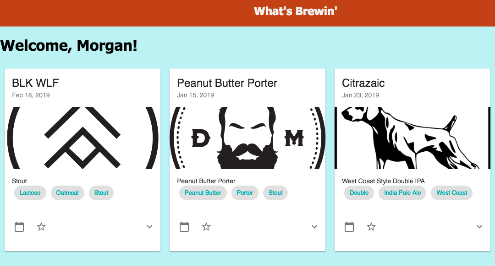

# Recovery St. Paul
This application uses React, Redux, Express, Passport, and PostgreSQL (a full list of dependencies can be found in `package.json`).

What's Brewin' is a craft beer release calendar with the aim of bridging the gap between craft brewers and their audience.  By being focused exclusively on craft beer, I aimed to separate What's Brewin' from other social media networks.

## Created With
- React.js
- React Redux
- Redux Sagas
- Node.js
- Express 
- Passport
- Material-UI
- PostgreSQL
- axios
- NPM


## Prerequisites

Before you get started, make sure you have the following software installed on your computer:

- [Node.js](https://nodejs.org/en/)
- [PostrgeSQL](https://www.postgresql.org/)
- [Nodemon](https://nodemon.io/)



## Create database and tables

Create a new database called `whats_brewin` and create these tables:

```SQL
CREATE TABLE "user" (
	"id" serial PRIMARY KEY NOT NULL,
	"username" varchar(100) UNIQUE NOT NULL,
	"userzip" int NOT NULL,
	"user_image" varchar(300);
	"avatar_id" int NOT NULL DEFAULT 1,
	"email" varchar(100) NOT NULL,
	"password" varchar(255) NOT NULL,
	"isBrewer" BOOLEAN NOT NULL DEFAULT 'false',
	"isAdmin" BOOLEAN NOT NULL DEFAULT 'false',
	"brewery_id" int REFERENCES "brewery"("id")),
	"user_since" DATE NOT NULL DEFAULT CURRENT_DATE;;

CREATE TABLE "brewery" (
	"id" serial PRIMARY KEY NOT NULL,
	"name" varchar(100) NOT NULL,
	"address" varchar(100) NOT NULL,
	"city" varchar(100) NOT NULL,
	"state" varchar(100) NOT NULL,
	"zip" int NOT NULL,
	"website" varchar(100) NOT NULL,
	"logo_url" varchar(300) NOT NULL),
	"bio" TYPE varchar(2000);	

CREATE TABLE "beer" (
	"id" serial PRIMARY KEY NOT NULL,
	"brewery_id" int NOT NULL REFERENCES "brewery",
	"name" varchar(100) NOT NULL,
	"style" varchar(100) NOT NULL,
	"release" DATE NOT NULL),
	"image_url" varchar(300),
	"description" varchar(1000);

CREATE TABLE "comment" (
	"id" serial PRIMARY KEY NOT NULL,
	"user_id" int NOT NULL REFERENCES "user",
	"comment" varchar(140) NOT NULL,
	"beer_id" int NOT NULL REFERENCES "beer");

CREATE TABLE "style" (
	"id" serial PRIMARY KEY NOT NULL,
	"tag" varchar(50) NOT NULL);

CREATE TABLE "follow" (
	"id" serial PRIMARY KEY NOT NULL,
	"user_id" int NOT NULL REFERENCES "user",
	"brewery_id" int REFERENCES "brewery",
	"followed_id" int REFERENCES "user");

CREATE TABLE "calendar" (
	"id" serial PRIMARY KEY NOT NULL,
	"user_id" int NOT NULL REFERENCES "user",
	"beer_id" int NOT NULL REFERENCES "beer");

CREATE TABLE "style_beer" (
	"id" serial PRIMARY KEY NOT NULL,
	"style_id" int NOT NULL REFERENCES "style",
	"beer_id" int NOT NULL REFERENCES "beer");

CREATE TABLE "avatar" (
	"id" serial PRIMARY KEY NOT NULL,
	"avname" int NOT NULL);

--STYLE TAGS, an ever expanding list

INSERT INTO "style" ("tag")
VALUES ('Amber'),('American'),('Pale Ale'),('Barleywine'),
('Black Ale'),('Black Lager'),('Schwarzbier'),('Black'),('Brett'),
    ('Baltic Porter'), ('Baltic'), ('Russian Imperial'), ('Imperial'), ('Brown'),
    ('Red'), ('Blonde'), ('Rose'), ('Pale'), ('Gold'), ('Cream'), ('Milkshake'),
    ('Ale'), ('Lager'), ('Stout'), ('Porter'), ('Wheat'), ('Rye'), ('India Pale Ale'),
    ('Barrel Aged'), ('Belgian'), ('Dubbel'), ('Tripel'), ('Double'), ('Quadrupel'),
    ('Strong Ale'), ('Lambic'), ('Flanders'), ('Gueuze'), ('Saison'), ('Weisse'), ('White'),
    ('Biere de Garde'), ('Witbier'), ('Bohemian'), ('English'), ('German'), ('Czech'),
    ('French'), ('Polish'), ('British'), ('Scottish'), ('Scotch'), ('Irish'), ('Norse'),
    ('Extra Special Bitter'), ('Bitter'), ('Sour'), ('Gose'), ('California Common'),
    ('Coffee'), ('Chocolate'), ('Coconut'), ('Vanilla'), ('Lactose'), ('Pilsener'),
    ('Mild'), ('Oatmeal'), ('Milk Stout'), ('Sweet Stout'), ('Old Ale'), ('Altbier'),
    ('Bock'), ('Dopplebock'), ('Export'), ('Fruit and Field'), ('Dunkel'),
    ('Dunkelweizen'), ('Hefeweizen'), ('Maibock'), ('Helles'), ('Kolsch'),
    ('Marzen'), ('Oktoberfest'), ('N/A'), ('Non Alcoholic'), ('Brown'), ('Pilsner'),
    ('Weizenbock'), ('Herb and Spice'), ('Gluten Free'), ('Honey'), ('Mead'), ('Cider'),
    ('Dry'), ('Dry Stout'), ('Brut'), ('New England'), ('Hazy'), ('Juicy'), ('Robust'),
    ('Session'), ('Autumn'), ('Harvest'), ('Pumpkin'), ('Wee Heavy'), ('Smoke'),
    ('Rauchbier'), ('Vienna'), ('Specialty'), ('Fruit'), ('Apricot'), ('Sweet'),
    ('Medium'), ('Apple'), ('Pear'), ('Berry'), ('Blueberry'), ('Raspberry'),
    ('Cherry'), ('Kriek'), ('Frambois'), ('Blackberry'), ('Peach'), ('Peppered'),
    ('Chili'), ('Hot Sauce Aged'), ('Whiskey Aged'), ('Cask'), ('Plum'), ('Watermelon'),
    ('Earl Grey'), ('Green Tea'), ('Black Tea'), ('Barrel Aged'), ('Aged'), ('Port Aged'),
    ('Rum Aged'), ('Islay'), ('Peated'), ('Tequila Aged'), ('Kentucky Common'),
    ('Wine Aged'), ('Sherry Aged'), ('Cognac'), ('Rum Aged'), ('Oak'), ('Maple'),
    ('Light'), ('Dark'), ('Heavy'), ('Dortmunder'), ('Berliner Weisse'), ('Steam Beer'),
    ('Summer'), ('Spring'), ('Winter'), ('Farmhouse'), ('Eisbock'), ('Earthy'),
    ('Oud Bruin'), ('Roggenbier'), ('Wild'), ('Mixed Culture'), ('Spontaneous Fermentation'),
    ('Mixed Fermentation'), ('Keller'), ('Best Bitter'), ('London'), ('Kettle Sour'),
    ('Passion Fruit'), ('Mango'), ('Strawberry'), ('Guava'), ('Kiwi'), ('Kvass'),
    ('Wood Aged'), ('Gruit'), ('Biere de Champagne'), ('Braggot'), ('Adjunct'),
    ('Zwickel'), ('Malt Liquor'), ('Sahti'), ('Happoshu'), ('India Pale Lager'), ('Faro'),
    ('Wheatwine'), ('Kristalweizen'), ('Yuzu'), ('Leichtbier'), ('Australian'),
    ('Sparkling'), ('Trappist'), ('Single'), ('Smash'), ('Single Malt'), ('Single Hop'),
    ('Lichtenhainer'), ('Piwo Grodziskie'), ('Munich'), ('Pre-Prohibition'),
    ('Tropical'), ('Cinnamon'), ('Peanut Butter'), ('Boysenberry'), ('Banana'), 
    ('West Coast'), ('Clove'), ('Lemon'), ('Grapefruit'), ('Tangerine'), ('Melon'), 
    ('Cacao'), ('Walnut'), ('Blood Orange'), ('Ginger'), ('Chai'), ('Roasty'), 
    ('Wet Hopped'), ('Dry Hopped'), ('Fresh Hopped'), ('Cryo'), ('Pineapple'), ('Crisp'), 
    ('Stone Fruit'), ('Funky'), ('Hoppy'), ('Bready'), ('Spices'), ('Citrus'), ('Corn'), 
    ('Pomegranate'), ('American Pale Ale'), ('New Zealand'), ('Northern'), ('Southern'), 
    ('Experimental'), ('Mint'), ('Ancient');
```

If you would like to name your database something else, you will need to change `whats_brewin` to the name of your new database name in `server/modules/pool.js`

## Development Setup Instructions

* Run `npm install`
* Create a `.env` file at the root of the project and paste this line into the file:
```
SERVER_SESSION_SECRET=superDuperSecret
```
    
SERVER_SESSION_SECRET
While you're in your new `.env` file, take the time to replace `superDuperSecret` with some long random string like `25POUbVtx6RKVNWszd9ERB9Bb6` to keep your application secure. Here's a site that can help you: [https://passwordsgenerator.net/](https://passwordsgenerator.net/). If you don't do this step, create a secret with less than eight characters, or leave it as `superDuperSecret`, you will get a warning.

* Start postgres if not running already by using `brew services start postgresql`
* Run `npm run server`
* Run `npm run client`
* Navigate to `localhost:3000`

## Features
- Beer release creation and deletion
- Calendar adding

## Future Features
- Profile images
- Image upload
- Editing
- Google Maps integration
- Twilio integration for release reminders
- In app messaging 
- Registration with Facebook
- Comments
- Beer release toggling, for repeating beers
- Password reset capability

## Created By
- Morgan Costigan https://github.com/morgancostigan


